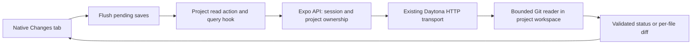

# Repository changes and diff implementation plan

Researched September 13, 2026 against working tree HEAD `0f9d1b3`. Research and proposal only; no application implementation or live Daytona verification was performed. Read the companion [API research](daytona-repository-changes-api-research.md) for exact provider contracts, Git examples, and the disposable local Git probe.

## Implemented API — September 13, 2026

The requested first implementation supersedes the separate status/diff endpoint proposal below: `GET /api/projects/:projectId/changes` returns the entire changed-file list **and each available staged/unstaged patch in one response**, without pagination. Client actions, query hooks and native UI wiring remain subsequent work.

- The success envelope is `{ error: false, message, data }`. [The response contract](../../src/features/projects/actions/change-schemas.ts) defines `repositoryState`, `currentBranch`, `headSha`, `isDetached`, `observedAt`, and `changes`. Each entry includes its original/current path, independent index/worktree statuses, file modes, kind, conflict/untracked flags, and nullable `staged`/`unstaged` diff objects. A null diff means no change on that side. Each present diff has `patch`, `additions`, `deletions`, and `unavailableReason`.
- [The route](../../src/app/api/projects/[projectId]/changes+api.ts) checks the session and project ID. [The reader](../../src/services/daytona/changes.ts) independently authenticates, resolves an owned ready project, verifies sandbox labels, and uses the established Daytona HTTP transport. Responses are private and uncached; restoration retains `503` and `Retry-After: 3`. No client-provided sandbox, path, branch or Git command is accepted.
- [The sandbox command](../../src/services/daytona/changes-command.ts) reads porcelain-v2 status, retrieves bounded HEAD/index blobs with `cat-file`, and captures saved worktree bytes through the same protected Linux reader used by the editor. It then invokes `git diff --no-index` on temporary copies to produce patches, accepting exit code 1 as differences. Untracked files compare against empty content. The repository index and checkout remain untouched; temporary copies are removed after use.
- Comparisons use **stored Git blob bytes versus saved filesystem bytes**. Worktree normalization filters and textconv are not applied; custom clean filters or CRLF normalization can therefore yield patches different from a normal configured `git diff`. Configured parent-repository clean/process filters and fsmonitor are disabled for status. Patch paths are display labels; the separate path fields are authoritative. Rename identity and executable-mode changes remain explicit even with zero changed text lines.
- Binary/non-UTF-8, oversized, symlink, submodule and conflict entries remain visible. When a patch is unavailable, its patch and counts are null, with `binary`, `too-large`, `unsupported`, or `conflict` as the reason. Nested untracked repositories are represented as unsupported submodule entries. Ignored files are excluded.
- Limits are 5,000 entries, 1 MiB per content side, 256 KiB per patch, 8 MiB serialized response, an eight-second command work budget and a 12-second Daytona execution timeout. Oversized individual previews retain metadata. An incomplete overall list/response returns `413 CHANGES_TOO_LARGE`; execution failures never become a clean empty list. Each Git subprocess uses the remaining deadline and `SIGKILL` on timeout.
- HEAD/status, index bytes and inspected file identities/timestamps are rechecked before success. Detected changes return `409 WORKSPACE_CHANGED`. This detects ordinary concurrent writes, including edits that remain `M`; it is an observation, not an atomic snapshot or a token authorizing a later commit. Unsaved editor buffers are outside this API's scope.
- Known fresh non-Git workspaces return `not-initialized`; unborn branches and detached HEAD are distinct. Missing imported repositories and unsupported external Git directories fail explicitly. GET never initializes, stages, fetches or checks out a repository.

Implementation references were rechecked against [Expo SDK 57](https://docs.expo.dev/versions/v57.0.0/), [Expo API routes](https://docs.expo.dev/router/web/api-routes/), [Daytona process execution](https://www.daytona.io/docs/en/typescript-sdk/process/#executecommand), [Git status](https://git-scm.com/docs/git-status), [Git diff](https://git-scm.com/docs/git-diff), [Git configuration](https://git-scm.com/docs/git-config), and [Node subprocess limits](https://nodejs.org/api/child_process.html#child_processexecfilesyncfile-args-options). Installed Daytona 0.210.0 retains the documented execute-command contract; the existing HTTP adapter is preserved.

Verification: 118 tests passed across the new API and changes reader plus existing filesystem regressions, with the full test runner and fixtures on Linux tmpfs in an isolated container (Node 24, Git 2.39.5). Earlier macOS shared-mount runs intermittently failed existing symlink-race fixture assertions; the Linux-native run passed all 118. TypeScript typechecking and Expo's API-only server export passed. Fixtures cover access/restoration, clean/unborn/detached repositories, nested untracked files, unusual paths, staged/unstaged cancellation, renames/deletions, binary/large content, mode changes, conflicts/gitlinks, limits, concurrent edits and the existing protected read/save behavior. No live Daytona workspace was accessed; deployed image/provider verification remains outstanding.

## Recommendation

Keep the live commit-history implementation. Next, replace the demo Changes tab with authenticated reads of the actual Daytona checkout, then add a per-file diff viewer and commit-detail inspection. Use the existing Toolbox HTTP transport to execute bounded Git commands inside Daytona. The phone receives validated feature JSON; it does not receive provider credentials or execute Git.

Do not maintain a second file-change ledger in Postgres for this feature. Git already owns commit history, the index owns staged content, and the sandbox filesystem owns saved working content. A later agent activity log or durable review/recovery record has different responsibilities and cannot be reconstructed from Git status alone.

## Requirements and evidence reviewed

- [Codaloud in Notion](https://app.notion.com/p/3d2b3d6d3d6f809b9c82e98a68e01be1), fetched September 13, page last edited September 12: current branch, working status, changed/untracked files, basic history, readable diffs, tracked/untracked/both commit choices, separate push, local Git without GitHub, and pending-save completion. The broader roadmap also includes conflict resolution and per-operation AI review/recovery. Those are follow-on work, not implied capabilities of the read-only inspection layer.
- Linked [Sandbox Creation Plan](https://app.notion.com/p/3d5b3d6d3d6f8128ac13d186ea7e28c1), fetched September 13, last edited September 8: useful earlier lifecycle design, but its proposed paths, setup behavior, and code are not proof of current implementation.
- All project Markdown outside dependency/tool skill trees: [AGENTS.md](../../AGENTS.md), [CLAUDE.md](../../CLAUDE.md), [README.md](../../README.md), [LICENSE.md](../../LICENSE.md), [Daytona capabilities](daytona-git-capabilities.md), [history proposal](daytona-commit-history.md), and [file-search research](workspace-file-search.md). README contains starter instructions, and older research describes work now implemented. Actual code determines implementation status; Notion defines intended behavior. Prior chat transcripts were not available as a separate source.
- Installed stack: `@daytona/sdk` 0.210.0; Expo 57 / Router 57; React Native 0.86.3; TanStack Query 5.102.8; Zod 4.5.4. Daytona's live docs show v0.211. Read the exact [Expo 57 reference](https://docs.expo.dev/versions/v57.0.0/) and [API route documentation](https://docs.expo.dev/router/web/api-routes/). The mobile app keeps its existing API server export and Expo DOM/WebView editor.

## What exists today

| Area | Existing implementation | Consequence |
| --- | --- | --- |
| Local history | [commits.ts](../../src/services/daytona/commits.ts), [commits-command.ts](../../src/services/daytona/commits-command.ts) | Already executes `git log` in Daytona, with bounded batches, full messages, parents, commit dates, shallow detection and SHA-pinned pagination. Preserve it. |
| Remote history | [GitHub commits reader](../../src/services/github/server/commits.ts) | Reads GitHub history independently. It cannot describe saved uncommitted sandbox files. |
| History API/UI | [commits route](../../src/app/api/projects/[projectId]/commits+api.ts), [history hook](../../src/features/projects/hooks/use-project-commit-history.ts), [commit list](../../src/features/projects/components/project-commit-list.tsx) | Authenticated local/remote history and search already reach native UI. Commit details/file history are extensions. |
| Branch selection | [workspace branch provider](../../src/features/projects/hooks/use-project-workspace-branch.tsx), [Daytona branches](../../src/services/daytona/branches.ts) | Branch data is real, but selecting a history branch is UI state, not checkout. |
| Changes screen | [Git screen](../../src/app/projects/[projectId]/git.tsx), [demo changes](../../src/features/projects/data/demo-changes.ts), [changes panel](../../src/features/projects/components/project-changes-panel.tsx) | Rows and line counts are fixtures. Selection is local UI state. Commit button is disabled. There is no live diff request. |
| Saved edits | [save registry](../../src/features/projects/hooks/use-project-file-save.tsx), [save document](../../src/features/projects/lib/project-file-save-document.ts), [filesystem service](../../src/services/daytona/filesystem.ts) | Reuse ordered saves, `flushPendingSaves()`, successful-save callbacks and content-hash concurrency checks. |
| Server boundary | [workspace access](../../src/features/projects/server/project-workspace.ts), [Daytona API](../../src/services/daytona/api.ts), [command encoder](../../src/services/daytona/create-command.ts) | Reuse ownership, readiness/restoration, sandbox-label validation and encoded input transport. SDK imports have a documented bundling issue in the existing branches adapter; preserve the HTTP route pattern. |

The current source has no production Git initialization call for fresh workspaces. An imported repository normally has `.git`; a fresh workspace can have files without a repository. Represent this separately from an initialized repository with no commits. Do not mutate a repository inside a GET request or silently recreate missing Git metadata on an import. Explicit initialization can be introduced with the first local-commit workflow. This corrects an assumption in the older sandbox plan.

The existing local history request requires a named branch. Detached-checkout status can be displayed by the new status reader, but browsing history directly from a detached HEAD would require a separately validated SHA-based history input. Do not describe that behavior as already supported or manufacture a branch name for it.

## Separate the kinds of information

| Information | Source and interpretation |
| --- | --- |
| Commit history | Git objects reachable from the selected local ref, or the selected GitHub ref for remote history. Unpushed local commits are available only in the sandbox. |
| Current checkout | Actual symbolic HEAD/commit in the sandbox. Return `currentBranch`, `headSha`, and detached/unborn state. Never derive these from the history picker. |
| Staged changes | HEAD to index. These are already prepared for a commit, including work staged by external tools. |
| Unstaged changes | Index to saved working files. Unsaved phone editor content is not here yet. |
| Untracked files | Files outside the index, subject to Git ignore rules. This includes new files; ignored files are excluded by default. |
| Net changes | HEAD to current tracked files. Useful optional presentation, but not the source of the changed-file list. |
| Attribution | Git status does not say whether an edit came from a user, AI, formatter or command. Author metadata describes commits, not who changed every dirty line. Agent attribution/recovery needs recorded operations and before/after versions later. |

These comparisons use [Git's status protocol](https://git-scm.com/docs/git-status) and [diff semantics](https://git-scm.com/docs/git-diff). A staged edit can be undone in the working file, leaving nonempty staged and unstaged changes but an empty net diff. Keep both states; do not add their line counts and call the result a net diff.

## Data flow and endpoints



Proposed product API, not Daytona endpoint names:

| Endpoint | Request | Response |
| --- | --- | --- |
| Existing `GET /api/projects/:id/commits` | `source`, `branch`, existing search/cursor parameters | Keep existing SHA-pinned history pages. |
| New `GET /api/projects/:id/changes` | Project only initially | Actual checkout, repository state, changed entries, observation time. No history branch parameter. |
| New `GET /api/projects/:id/diff` | Relative path, `staged` or `unstaged`, expected observation context | One file's normalized patch/hunks, line counts or unavailable reason, and actual base/target identifiers. Handle untracked entries as additions from empty content. |
| New `GET /api/projects/:id/commits/:sha` | Explicit `source`; bounded file-list cursor; parent selection for merges | Commit metadata, changed files and available parent choices. |
| Extended diff request | Validated commit SHA, selected parent, source, path | Historical file diff, independent of current checkout. Root commits compare against empty content. |

Start with a complete bounded status response; do not download every patch when opening the list. Proposed limits: 5,000 changed entries, 2 MiB serialized status, 1 MiB text input per side of a file diff, 256 KiB patch output, eight-second Git work budget and 12-second outer command timeout. Measure these in the sandbox image before shipping. These are application policy proposals, not Daytona guarantees. Return an explicit limit error if status cannot be complete; never return `[]` for a capped scan. Binary/large-file metadata can still appear while text preview is unavailable. If status pagination becomes necessary, use a bounded result generation/cursor and distinguish it from live filesystem state.

## Suggested contract

Illustrative TypeScript for the feature boundary, not implemented production code. In implementation, define Zod response schemas in `features/projects/actions/change-schemas.ts`, export each inferred type there, reuse existing hash/path schemas where suitable, and put other feature types in `features/projects/types.ts`.

```ts
export const projectRepositoryStates = [
  "ready", "unborn", "not-initialized",
] as const;
export type ProjectRepositoryState =
  (typeof projectRepositoryStates)[number];

export const projectGitFileStates = [
  "unchanged", "modified", "added", "deleted", "renamed",
  "copied", "type-changed", "unmerged", "untracked",
] as const;
export type ProjectGitFileState = (typeof projectGitFileStates)[number];

export type ProjectRepositoryChange = {
  path: string;
  originalPath: string | null;
  indexStatus: ProjectGitFileState;
  worktreeStatus: ProjectGitFileState;
  isUntracked: boolean;
  isConflicted: boolean;
  kind: "file" | "symlink" | "submodule";
};

export type ProjectRepositoryChanges = {
  repositoryState: ProjectRepositoryState;
  currentBranch: string | null;
  headSha: string | null;
  isDetached: boolean;
  observedAt: string;
  changes: ProjectRepositoryChange[];
};

export type ProjectFileDiff = {
  path: string;
  originalPath: string | null;
  baseLabel: string;
  targetLabel: string;
  observedHeadSha: string | null;
  baseContentHash: string | null;
  targetContentHash: string | null;
  patch: string | null;
  additions: number | null;
  deletions: number | null;
  unavailableReason: "binary" | "too-large" | "unsupported" | null;
};
```

This is intentionally richer than the current `ProjectChangeData`, which has one status and mandatory numeric counts. An unavailable count is not zero. Use named exhaustive formatters in the existing feature `lib/formatters.ts`; retain semantic theme colors. If path identity cannot be represented safely (invalid UTF-8, for example), return an explicit unsupported-path result/error, not a corrupted name. Conflict entries need their own display; the subsequent resolver will need index stages 1/2/3 and operation state beyond this list contract.

## Example: use the existing transport

The adapter follows `readSandboxCommits`. The snippet shows only the established transport seam; `sandboxChangesCommand` and its schemas are proposed. Authentication, owned ready-project resolution, sandbox binding checks, home-directory validation, deadline creation, and final feature normalization must surround it.

```ts
const response = await requestDaytona(`${toolboxUrl}/process/execute`, {
  method: "POST",
  signal,
  body: JSON.stringify(
    createSandboxCommand(sandboxChangesCommand, { home }, 12),
  ),
});

const executed = sandboxExecutionSchema.parse(response);
if (executed.exitCode !== 0) {
  // Translate the helper's structured code into a safe feature error.
  throw mapRepositoryReadError(executed.result);
}

return projectRepositoryChangesSchema.parse(JSON.parse(executed.result));
```

The helper invokes Git with argument arrays and emits bounded JSON. User-supplied paths/refs stay in encoded data, never shell fragments. `child_process` runs in the sandbox helper, not in the Expo API runtime. The corresponding Daytona SDK execution signature is documented in the [Process reference](https://www.daytona.io/docs/en/typescript-sdk/process/#executecommand); retaining the current HTTP transport avoids adding a new runtime dependency path.

## Example: flush saves and query real changes

Illustrative hook core; imports and richer typed restoration/limit error handling are omitted. The new action would use the established data-or-null contract and safe response validation. All query configuration stays in this hook, following project conventions.

```ts
export const useProjectChanges = (projectId: string, enabled: boolean) => {
  const session = useAuthSession();
  const userId = !session.isPending && !session.error
    ? session.data?.user.id ?? null
    : null;
  const validProject = isValidIds(projectId);
  const { flushPendingSaves } = useProjectFileSaveRegistry();

  return useQuery({
    queryKey: ["projects", "changes", userId, projectId],
    enabled: enabled && Boolean(userId) && validProject,
    staleTime: 0,
    refetchOnMount: "always",
    refetchOnReconnect: true,
    refetchOnWindowFocus: true,
    retry: false, // Production hook adds explicit restoration/transient retries.
    queryFn: async ({ signal }) => {
      if (!userId || !validProject) throw new Error("Invalid project session.");
      await flushPendingSaves();
      signal.throwIfAborted();
      const changes = await readProjectChangesAction(projectId, signal);
      if (changes === null) throw new Error("Unable to load repository changes.");
      return changes;
    },
  });
};
```

Use the existing [query lifecycle integration](../../src/lib/query-lifecycle.ts), which already connects React Native AppState and Expo network state. Query's focus option receives that native integration; no browser event system is needed. Fetch on Changes-tab activation, return to foreground, reconnect and manual refresh; invalidate after confirmed save/create/rename/delete and future Git or agent mutations. Coalesce notifications while a save flush is in progress so invalidation does not repeatedly cancel the read waiting for those same saves. Screen/tab activation also needs explicit handling because retained mounted screens do not remount. These choices follow [TanStack's React Native integration](https://tanstack.com/query/v5/docs/framework/react/react-native).

Default to no idle polling. If an accepted external task is running, temporarily refresh the visible Changes tab at a measured interval or invalidate when its completion arrives. A manually triggered external command cannot push a change notification through these Git APIs. Without a watcher, the UI is current as of its last observation; expose refresh and avoid claiming continuous real-time synchronization.

When clicking a row, reload that file's diff after pending saves settle. Historical commit diffs need no save flush because their content is immutable. Clear obsolete selections when paths disappear or repository context changes. Keep checkbox selection separate from an accessible Open diff action.

## Diff interpretation and rendering

Start with a native, read-only unified diff: filename, comparison labels, status, additions/deletions when available, hunk headers and old/new line numbers. A virtualized native list suits long patches; preserve horizontal code scrolling and readable text sizes. Use semantic addition/deletion colors and accessibility labels. Avoid adding a DOM-only diff library to native screens. The existing CodeMirror WebView can support a richer review editor later if needed.

Represent staged and unstaged sections independently. A row with both can open the appropriate section. Untracked content is compared with empty content without `git add`, including no intent-to-add write. Preserve empty added files as status entries even when their patch has no text lines. Treat executable-mode-only changes, symlinks, submodules, renames and conflicts as metadata-bearing changes, not empty success. Do not follow symlinks to display outside content.

Use Git status to identify files; use NUL-delimited `--numstat` when summary counts are requested, and fetch patches on demand. Rename output has multiple paths; binary stats use nonnumeric markers. A diff endpoint should return authoritative separate path metadata instead of making the phone recover identity from human-readable patch headers. A robust parser must handle multiple hunks, quoted paths, no-final-newline markers and metadata-only patches.

For historical details, retain full commit hashes and parent hashes already supplied by local history. A normal commit compares with its parent; a root commit compares with empty content; a merge defaults to explicitly labeled first-parent comparison and offers other parents. Do not assume a merge's default `git show` output contains all ordinary per-file patches. A shallow clone may be missing the required parent: return unavailable ancestry rather than fabricate empty content. File history can extend the current local reader with a path filter; `git log --follow` supports a single file and has rename/history simplification limitations. Pin the same starting SHA across its pages. [Git log](https://git-scm.com/docs/git-log).

For a remote-only commit, use GitHub's commit endpoint through the existing owned-project/token boundary. Never silently fetch or checkout to inspect it. GitHub paginates large JSON file lists and caps them at 3,000 files; binary patches may be absent, and large diff responses can fail. Preserve those limits in the UI. [GitHub Get a commit](https://docs.github.com/en/rest/commits/commits#get-a-commit).

## Consistency, boundaries, and failure behavior

- Resolve workspace and sandbox exclusively from the owned project. Reuse safe root/path logic, but do not assume the existing regular-text editor reader can read deleted files, Git blobs, or symlink contents.
- Validate `.git` and worktree/common-directory boundaries; reject external Git directories/worktrees unless explicitly supported. Sanitize inherited `GIT_*` variables, disable replacement objects, pagers, prompts, fsmonitor hooks, external diff tools and textconv execution. Git config/attributes are repository input. Normalization filters can still matter for tracked worktree reads; review this separately rather than assuming `--no-ext-diff` disables all execution.
- Use a bounded subprocess/output collector and validate both stdout and stderr bounds. Timeouts, cancellations and response byte limits need sandbox enforcement; aborting the HTTP request alone is not a process-kill guarantee. The implementation must verify child termination.
- Return observation time and resolved HEAD. For per-file reads, inspect base/index/blob identity plus file identity/content before and after the read; retry a detected race once or return `409 WORKSPACE_CHANGED`. A HEAD/status string alone misses edits that remain `M`.
- Do not claim filesystem transactionality. Re-reading metadata detects ordinary changes but is not an atomic snapshot. App-controlled mutations can later share coordination; external processes still require conflict detection. Pin historical comparisons by immutable object IDs.
- Missing import workspace/repository, corrupt Git, unavailable sandbox and command errors are failures, not clean status. A known fresh non-Git workspace gets `not-initialized`; an initialized branch with no commit gets `unborn`. Detached HEAD has a SHA but no branch name. No read performs initialization, fetch, reset or checkout.
- Responses use `Cache-Control: private, no-store`, with existing restoration status and retry headers. Read actions return valid data including empty collections or `null` on failure; query hooks turn `null` into error UI. Preserve stale data only with a visible updating/error state.
- Git status enumerates all relevant changed tracked files even if file-explorer visibility preferences hide them. Respect Git ignore rules for untracked paths. Editor/file-search exclusion rules have a different purpose and cannot define commit scope.
- Ahead/behind values from local remote-tracking refs describe the last known remote state; absent upstream is unknown, not zero. Fresh GitHub status requires a separate remote operation.

## Implementation sequence

Each chunk below has fewer than ten files including tests. Write behavioral tests before the implementation in each chunk; never add dedicated schema tests. Listed paths are proposed, not created by this research. If integration expands a chunk beyond nine files, split it before implementation.

| Chunk | Files to add/change | Independently verifiable outcome |
| --- | --- | --- |
| 1. Repository status API (7) | `features/projects/actions/change-schemas.ts`; `services/daytona/changes-command.ts`; `services/daytona/changes.ts`; `app/api/projects/[projectId]/changes+api.ts`; `features/projects/actions/git-actions.ts`; `services/daytona/tests/changes.test.ts`; `features/projects/tests/project-changes-api.test.ts` | Authenticated real status, explicit fresh/unborn/detached states, untracked entries, dual staged/unstaged states and safe errors. Verify against disposable fixture repositories. |
| 2. Live native Changes tab (8) | `features/projects/hooks/use-project-changes.ts`; `features/projects/types.ts`; `features/projects/lib/formatters.ts`; `features/projects/components/project-changes-panel.tsx`; `app/projects/[projectId]/git.tsx`; remove `features/projects/data/demo-changes.ts`; `features/projects/tests/project-changes-query.test.tsx`; `features/projects/tests/project-changes-panel.test.tsx` | Real status with checkout identity, save flush, loading/restoring/error/empty/not-initialized and refresh on activation. Keep numeric counts unavailable until measured. Selection still has no mutation side effect. Verify iOS and Android. |
| 3. Mutation-driven refresh (5) | `features/projects/hooks/use-project-file-save.tsx`; `features/projects/hooks/use-project-files.ts`; `features/projects/hooks/use-project-changes.ts`; `features/projects/tests/project-file-save.test.tsx`; `features/projects/tests/project-files-query.test.tsx` | Successful save/create/rename/delete invalidates changes without loops; failed saves do not masquerade as current review. Reconcile selected paths after refresh. Existing file mutation hooks must be rechecked before editing. |
| 4. Per-file diff API (8) | `features/projects/actions/diff-schemas.ts`; `services/daytona/diff-command.ts`; `services/daytona/diffs.ts`; `app/api/projects/[projectId]/diff+api.ts`; `features/projects/actions/git-actions.ts`; `features/projects/hooks/use-project-file-diff.ts`; `services/daytona/tests/diffs.test.ts`; `features/projects/tests/project-diff-api.test.ts` | Bounded staged/unstaged/untracked diff and real counts; handles deletion, rename, binary, large-file, mode-only and race errors without modifying the index. |
| 5. Native diff review (7) | `features/projects/lib/diffs.ts`; `features/projects/components/project-file-diff.tsx`; `app/projects/[projectId]/diff.tsx`; `features/projects/components/project-changes-panel.tsx`; `features/projects/lib/formatters.ts`; `features/projects/tests/project-diff-parser.test.ts`; `features/projects/tests/project-file-diff.test.tsx` | Tap a file, read actual hunks and comparison labels, return to Changes. Tests first for parser edge cases; verify scrolling/accessibility/navigation on both native platforms. Check parent layout registration and split any additional wiring if needed. |
| 6. Local commit details (8) | `features/projects/actions/commit-detail-schemas.ts`; `services/daytona/commit-details-command.ts`; `services/daytona/commit-details.ts`; `app/api/projects/[projectId]/commits/[sha]+api.ts`; `features/projects/actions/git-actions.ts`; `services/daytona/diff-command.ts`; `services/daytona/tests/commit-details.test.ts`; `features/projects/tests/project-commit-details-api.test.ts` | Commit file list and parent-based per-file patch selection, including root/merge/missing shallow parent, all pinned by object ID. |
| 7. History detail UI (6) | `features/projects/hooks/use-project-commit-details.ts`; `features/projects/components/project-commit-list.tsx`; `app/projects/[projectId]/commit.tsx`; `features/projects/components/project-file-diff.tsx`; `features/projects/tests/project-commit-details-query.test.tsx`; `features/projects/tests/project-commit-details-screen.test.tsx` | Local history row opens changed files and diffs; reuse the diff viewer. Remote rows explain unavailable details until the next chunk. |
| 8. Remote commit details (5) | `services/github/server/commit-details.ts`; `app/api/projects/[projectId]/commits/[sha]+api.ts`; `app/api/projects/[projectId]/diff+api.ts`; `services/github/tests/commit-details.test.ts`; `features/projects/tests/project-commit-details-api.test.ts` | Remote-only SHA details use GitHub, with explicit pagination/patch limitations and source isolation. |

File-specific history is an optional subsequent chunk: extend the current history params, schema, pagination scope, local command and hook, plus command/query tests (seven files), then wire an Open file history action in a separate small UI chunk if desired. It is not required to make the existing repository history real.

The next write feature after inspection is local commit creation, including deliberate Git initialization for fresh projects. Plan it separately: finish saves, capture checkout and reviewed content, coordinate mutations, define existing-index policy, stage exactly the selected scope including deletions, create one commit, then invalidate history/changes. A naive `add(selected); commit()` can include unrelated previously staged files. Push remains a separate accepted operation with partial-success recovery. Do not enable the current disabled commit button merely because status has become live.

## Verification gates

Test behavior in disposable repositories before each implementation: clean state; untracked/ignored/nested files; staged and unstaged changes in one file; staged edit canceled in worktree; deletion; staged and unstaged renames; spaces/newlines/Unicode and unsupported path encoding; binary/empty/oversized files; mode changes; symlinks and external `.git`; conflicts/submodules; fresh non-Git and unborn repository; detached HEAD; root and merge commits; shallow ancestry; changed file between list and diff; authorization; save failure; limits; obsolete queries and retries.

Use service tests under `src/services/daytona/tests/` and feature tests under `src/features/projects/tests/`. For Linux-specific containment behavior, adapt the existing `scripts/test-daytona-filesystem.sh` runner. Run focused tests, `pnpm exec tsc --noEmit`, and `pnpm export:api` for server-boundary changes. Verify UI chunks on iOS and Android; stop any app instance started for verification. Inspect added/renamed filenames and imports at every completion.

Research validation so far consists of source/documentation inspection and the companion note's disposable local Git probe. It does not establish deployed Toolbox status semantics, actual sandbox Git/filter configuration, EAS execution compatibility of new code, device layout/performance, or remote termination behavior. Settle those with the first implementation chunks; do not claim them verified now.
