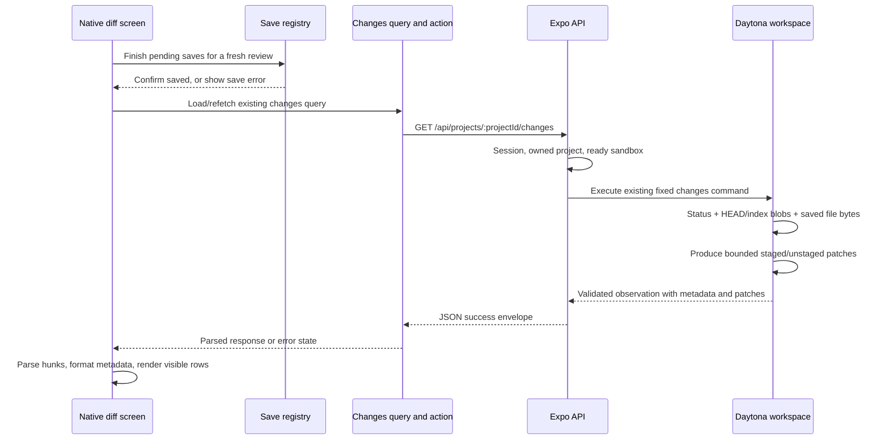

# Real workspace diff implementation plan

Researched September 13, 2026. Planning only: the examples below describe proposed changes, not application code implemented by this document. Read [the provider notes](workspace-diff-api-notes.md) for the Daytona/Git evidence behind this plan.

## Implemented parsing checkpoint — September 13, 2026

The first data-preparation chunk is now implemented. [Display types](../../src/features/projects/types.ts) define serializable file comparisons, hunks, line numbers, and scoped totals. [parseProjectDiffPatch](../../src/features/projects/lib/diff-patch.ts) validates our producer's complete two-way patches and returns structured hunks or null. [createProjectWorkspaceDiff](../../src/features/projects/lib/workspace-diff.ts) consumes the existing validated project changes data, preserves repository/file metadata and both comparison scopes, and isolates invalid/unavailable previews.

```ts
const changes = await readProjectChangesAction(projectId, signal);
if (changes === null) return null;
const workspaceDiff = createProjectWorkspaceDiff(changes);
// workspaceDiff.files contains staged/unstaged comparison objects.
// Available comparisons have hunks with beforeText, afterText and line ranges.
// Each hunk contains excerpts only, not complete original/modified files.
```

Query consumers memoize `createProjectWorkspaceDiff(query.data)` by the data identity. Fetching and response validation remain in the existing action/hook. No new network wrapper or renderer dependency was introduced. Metadata-only changes remain available with zero hunks; malformed patches or mismatched server counts become `invalid-patch` previews rather than breaking other files. Missing scopes stay null, and unavailable counts remain null; summary totals separately disclose their unavailable count.

Verification: the [43 parsing/transformation tests](../../src/features/projects/tests/project-workspace-diff.test.ts) passed, including real local Git-generated patches. The remaining sections describe the broader proposal and should not be read as implementation status.

## Implemented native UI checkpoint — September 13, 2026

The [workspace diff route](../../src/app/projects/[projectId]/git/workspace-diff.tsx) now reads `useProjectChanges(projectId)` and memoizes the transformation above. The existing native file list renders each staged/unstaged comparison with real hunks, semantic addition/deletion colors, horizontal scrolling, and rename/mode metadata. Initial loading, retryable errors, paused/offline reads, cached refresh failures, refreshing, clean workspaces, and uninitialized repositories have explicit states. Explicit refresh and pull-to-refresh use the existing hook. The Changes panel summary uses the same transformation. The demo data and its obsolete types/formatters have been removed.

UI correction after review: the compact summary contains only View Full Diff and combined available addition/deletion counts, with an em dash when none are available. Scope labels, the branch heading, raw hunk headers, and missing-final-newline notices are hidden. The parser still preserves that metadata. Each row displays one line number (old for deletions, new otherwise) and a spaced change marker; source indentation is preserved. File containers use a solid semantic card background, and row backgrounds are applied once to the containing View, with text color applied separately. This removes the double translucent deletion tint and mismatched patches of card color. The layout uses the existing shared typography, consistent with [React Native 0.86 Text guidance](https://reactnative.dev/docs/0.86/text) and [View styling](https://reactnative.dev/docs/0.86/view-style-props), checked against [Expo 57](https://docs.expo.dev/versions/v57.0.0/).

Correction verification: 97 tests passed across the parser, screen, and Git panel suites; TypeScript passed. New regression assertions first reproduced eight failures covering unwanted labels, duplicate gutters, and repeated background classes, then passed after the fixes. The raw-header removal was also checked with a failing test first. The existing iOS simulator displayed the compact +13/−1 summary and the corrected two-file diff. Android interaction was not rerun for these presentation changes.

Verification: 145 tests passed across the parser, screen, Git panel, changes query, read action, and project screen-state suites; TypeScript and `git diff --check` passed. The Android native export, including the existing editor DOM bundle, succeeded. On the already-running iOS simulator, Meet AI displayed two actual changed files with matching +13/−1 summary totals; loading, navigation to the full diff, refresh with retained content, and horizontal/vertical scrolling were checked. Android device interaction and large-file performance were not verified.

This checkpoint implements the requested reuse of the current native UI. It preserves existing cache/save behavior and file-level virtualization. The broader proposal's save-flush controller, create invalidation, classified errors, line-level virtualization, navigation/filter enhancements, and full-document CodeMirror comparison remain separate work; the entire proposed Milestone A/B sequence is not marked complete.

## Collapsible file cards — September 14, 2026

File containers now use `bg-card/25`, with no second background on unchanged rows. Each header is an accessible native button with an up/down chevron; all files start expanded. Collapse state lives in the list by file path and is passed through `extraData`, so virtualized rows and refreshed data preserve the user's choice. The route keys the view by project ID so another project starts expanded. This follows the existing native [Pressable](https://reactnative.dev/docs/0.86/pressable) and [FlatList state guidance](https://reactnative.dev/docs/0.86/flatlist). Verification: 57 screen/Git-panel tests and TypeScript passed; collapse, expand, and the softer background were checked in the existing iOS simulator.

## Recommendation and scope

Make the existing native workspace diff route consume the **existing real changes response** first. Build a proper unified-patch presentation on that data. Then add a focused, read-only CodeMirror diff pane for syntax highlighting, inline differences, and expandable unchanged context, loading complete before/after documents only for the selected file.

These are two complete milestones. Milestone A makes the current feature real and readable without a new endpoint or dependency. Milestone B supplies the richer editor experience. The current all-files response stays intact; do not silently replace it with pagination or a status-only response. A separate scalability change would need its own scope.

This work covers saved, uncommitted changes in the actual Daytona checkout, including staged, unstaged, and untracked files. It does not implement commit, push, stage, discard, conflict resolution, historical commit diffs, or attribution of edits to an agent. Those operations need their own mutation and recovery contracts. Git inspection works without a GitHub connection.

## Requirements and sources checked

- Fetched [Codaloud in Notion](https://app.notion.com/p/3d2b3d6d3d6f809b9c82e98a68e01be1), last edited September 12. It requires a native phone app, readable Git diffs, local Git without GitHub, API routes with server authentication/ownership checks, CodeMirror in a WebView, ordered confirmed saves, and eventual conflict resolution. A plain diff reader does not fulfill the separate conflict-editor requirement.
- Fetched its linked [Sandbox Creation Plan](https://app.notion.com/p/3d5b3d6d3d6f8128ac13d186ea7e28c1), last edited September 8. Some details are superseded: it proposes Git initialization for fresh projects and importing the default branch, while current source can report `not-initialized` and the newer product document requires branch selection on import. Use current source for implemented behavior and the newer requirements for intended behavior.
- Read the saved [Git capabilities](daytona-git-capabilities.md), [commit-history research](daytona-commit-history.md), [repository API research](daytona-repository-changes-api-research.md), [repository changes plan](repository-changes-plan.md), and [file-search research](workspace-file-search.md), plus repository instructions and README. Older proposals are useful context, but their implementation status is stale in places: changes API, action, hook, and list already exist.
- Read the exact [Expo 57 reference](https://docs.expo.dev/versions/v57.0.0/), [Expo API routes](https://docs.expo.dev/router/web/api-routes/), [native DOM components](https://docs.expo.dev/guides/dom-components/), [TanStack Query native integration](https://tanstack.com/query/latest/docs/framework/react/react-native), [React Native FlatList](https://reactnative.dev/docs/flatlist), and official CodeMirror sources linked below.
- Checked the project manifest and installed provider declarations: Daytona SDK 0.210.0; Expo `~57.0.20`; Router `~57.0.19`; React Native 0.86.3; React 19.2.3; TanStack Query `^5.102.8`; Zod `^4.5.4`; CodeMirror 6. Existing package ranges and the lockfile remain authoritative at implementation time.

Only iOS and Android are application targets. Expo API server export and the existing DOM/WebView editor are required infrastructure. This plan adds no web application target.

## 1. What is already real, and what is still mock

| Area | Current source | What remains |
| --- | --- | --- |
| Git collection | `src/services/daytona/changes-command.ts` | Already reads real status and generates staged/unstaged patches. Reuse. |
| Provider boundary | `src/services/daytona/changes.ts` | Already authenticates, resolves an owned ready project, checks sandbox binding, executes a bounded command, validates results. Reuse. |
| API | `src/app/api/projects/[projectId]/changes+api.ts` | Already returns real JSON, private/no-store headers, structured errors, restoration retry headers. Reuse. |
| Client validation | `src/features/projects/actions/git-actions.ts` | `readProjectChangesAction` already validates the response and returns data or null. Add failure metadata only to improve error UX. |
| Query | `src/features/projects/hooks/use-project-changes.ts` | Already caches by user and project; no polling. Preserve the shared cache. |
| Changes list | `src/features/projects/components/project-changes-panel.tsx` | Real list, but passes `demoChanges` to the summary. |
| Totals | `src/features/projects/components/project-workspace-diff-summary.tsx` | Assumes every file has numeric counts. Must handle real scopes and unavailable counts. |
| Full diff route | `src/app/projects/[projectId]/git/workspace-diff.tsx` | Directly renders `demoChanges`. Replace with live query state. |
| Full diff renderer | `src/features/projects/components/project-workspace-diff.tsx` | Splits mock strings into colored lines; no actual hunk parsing or line numbers. |
| Save lifecycle | `src/features/projects/hooks/use-project-file-save.tsx` | Already exposes `flushPendingSaves()` and invalidates changes after confirmed saves. Reuse. |
| File mutations | `src/features/projects/hooks/use-project-files.ts` | Rename/delete already invalidate changes. Creation currently invalidates only file listings; add the missing changes invalidation. |

The first implementation is therefore primarily a client integration and presentation task.

## 2. Where the actual data comes from



Daytona's installed Git API has status operations but no `sandbox.git.diff()`. Command execution is the appropriate primitive, and the project already implements it through authenticated Toolbox HTTP. No new SDK instance is needed in the API route. [Daytona Git](https://www.daytona.io/docs/en/typescript-sdk/git/), [Daytona Process](https://www.daytona.io/docs/en/typescript-sdk/process/)

The existing command performs these comparisons:

| Display section | Before | After |
| --- | --- | --- |
| Staged | HEAD blob; absent for a newly added file | Index blob |
| Unstaged | Index blob | Saved working file |
| New untracked file | Absent | Saved working file |

It captures the bytes first, writes temporary copies, and invokes `git diff --no-index` on those copies. Exit code 1 means a successful comparison with differences. The temporary files are removed; the repository index is not staged or changed. Raw stored blob bytes versus saved filesystem bytes are the current semantics, so custom clean filters and line-ending normalization can differ from a developer's configured local `git diff`. Preserve this existing behavior deliberately. [Current collector](../../src/services/daytona/changes-command.ts), [Git diff](https://git-scm.com/docs/git-diff)

This is the existing server-side transport shape, not new code to add:

```ts
const response = await requestDaytona(`${toolbox}/process/execute`, {
  method: "POST",
  signal: requestSignal,
  body: JSON.stringify(
    createSandboxCommand(
      sandboxChangesCommand,
      { home, allowEmptyRepository: !existingProject.githubRepositoryId },
      12,
    ),
  ),
});
```

The server derives the sandbox and workspace path from the owned project. The phone never sends a sandbox ID, shell command, arbitrary Git revision, or provider credential. Keep the current Linux path containment, filter disabling, subprocess budgets, and concurrent-change checks when extending the collector.

Do not reduce the feature to `git diff HEAD`: HEAD `A`, index `B`, and working file `A` produces an empty net diff while both staged and unstaged changes exist. Default the full workspace view to **All**, grouping each file's Staged and Unstaged sections separately; offer scope filters. Count distinct paths at the top, not the number of sections.

## 3. Server-to-client contract

Keep [change-schemas.ts](../../src/features/projects/actions/change-schemas.ts) as the source of truth. A representative existing response is:

```json
{
  "error": false,
  "message": "Project changes loaded.",
  "data": {
    "repositoryState": "ready",
    "currentBranch": "main",
    "headSha": "0123456789012345678901234567890123456789",
    "isDetached": false,
    "observedAt": "2026-09-13T15:00:00.000Z",
    "changes": [{
      "path": "src/greeting.ts",
      "originalPath": null,
      "indexStatus": "unchanged",
      "worktreeStatus": "modified",
      "isUntracked": false,
      "isConflicted": false,
      "kind": "file",
      "headMode": "100644",
      "indexMode": "100644",
      "worktreeMode": "100644",
      "staged": null,
      "unstaged": {
        "patch": "diff --git a/src/greeting.ts b/src/greeting.ts\n--- a/src/greeting.ts\n+++ b/src/greeting.ts\n@@ -1 +1 @@\n-export const greeting = 'Hi';\n+export const greeting = 'Hello';\n",
        "additions": 1,
        "deletions": 1,
        "unavailableReason": null
      }
    }]
  }
}
```

There are three different states to preserve:

- `staged: null`: no staged comparison for that entry.
- A present diff with `patch: ""`: a valid comparison with no textual hunks; inspect status/modes/rename metadata.
- A present diff with `patch: null` and an unavailable reason: the preview cannot be rendered; counts are unknown.

Do not convert either missing previews or request failures to an empty patch. The current response is all files plus available patches in one JSON response, with no pagination. Do not fetch again for every file in Milestone A.

The existing read action already does the transport parsing:

```ts
// Existing behavior inside readProjectChangesAction's try/catch:
const payload: unknown = await response.json();
return readProjectChangesResponseSchema.parse(payload).data;
// Validation/network/HTTP failures ultimately return null.
```

The hook turns null into a query error. The UI consumes the inferred `ProjectRepositoryChangesSchema` and `ProjectRepositoryChangeSchema`; retire the mock `ProjectChangeData` and `ProjectWorkspaceDiffFile` when their last consumer is migrated. Do not define a competing server DTO.

## 4. Formatting and parsing on the client

Treat metadata formatting, patch parsing, and visual rendering as separate responsibilities:

- `features/projects/types.ts`: display-only scope, row, and parsed-hunk types.
- `features/projects/lib/workspace-diff.ts`: pure transformations from validated changes/patches to sections, totals, and rows.
- `features/projects/lib/formatters.ts`: named exhaustive formatters for scope/status/unavailable reason/row style/mode labels. All color choices use semantic theme colors.
- Native components: selection, collapsed files, scrolling, accessibility, and loading/error UI.

Use the server's path fields for identity. Patch headers may quote unusual filenames; they are not authoritative navigation data. Separate a file's identity from its comparison scope. For example:

```ts
// Proposed display types in features/projects/types.ts.
export type ProjectDiffScope = "staged" | "unstaged";

export type ProjectDiffLine = {
  kind: "context" | "addition" | "deletion" | "no-newline";
  text: string;
  oldLine: number | null;
  newLine: number | null;
};

export type ProjectDiffHunk = {
  header: string;
  oldStart: number;
  oldCount: number;
  newStart: number;
  newCount: number;
  lines: ProjectDiffLine[];
};
```

A section adapter can preserve both scopes without concatenating unrelated patches:

```ts
import type { ProjectRepositoryChangeSchema } from "../actions/change-schemas";
import type { ProjectDiffScope } from "../types";

export const getProjectDiffSections = (
  changes: ProjectRepositoryChangeSchema[],
  scope: ProjectDiffScope,
) => changes.flatMap((change) => {
  const diff = change[scope];
  if (diff === null) return [];
  return [{
    key: JSON.stringify([change.path, scope]),
    change,
    scope,
    diff,
  }];
});
```

Use a real unified-diff parser. A small custom parser is reasonable here because the producer is our fixed two-way command, not arbitrary patch uploads. Write its behavioral tests before its implementation. If implementation broadens to arbitrary patches, reassess a maintained parser instead of expanding an ad hoc grammar indefinitely. The producer emits ordinary two-way hunks; conflicts are unavailable states, not combined `@@@` hunks. [Git patch format](https://git-scm.com/docs/diff-format)

The essential parsing logic is:

```ts
// Core fragment inside parseProjectDiffPatch; helpers/types are proposed.
// Preserve CR characters in source text: split on LF, not /\r?\n/.
const lines = patch.split("\n");
if (lines.at(-1) === "") lines.pop();

const headerPattern = /^@@ -(\d+)(?:,(\d+))? \+(\d+)(?:,(\d+))? @@(.*)$/;
let current: ProjectDiffHunk | null = null;
let oldLine = 0;
let newLine = 0;

for (const line of lines) {
  const header = headerPattern.exec(line);
  if (header) {
    // Verify the previous hunk's consumed old/new counts before continuing.
    if (current) assertCompleteProjectDiffHunk(current);
    current = {
      header: line,
      oldStart: Number(header[1]),
      oldCount: Number(header[2] ?? 1),
      newStart: Number(header[3]),
      newCount: Number(header[4] ?? 1),
      lines: [],
    };
    oldLine = current.oldStart;
    newLine = current.newStart;
    hunks.push(current);
    continue;
  }
  if (!current) {
    // Recognize file headers/mode metadata, reject unsupported hunk syntax.
    readProjectDiffMetadata(line);
    continue;
  }
  if (line === "\\ No newline at end of file") {
    current.lines.push({
      kind: "no-newline", text: line, oldLine: null, newLine: null,
    });
    continue;
  }
  switch (line[0]) {
    case " ":
      current.lines.push({ kind: "context", text: line.slice(1), oldLine: oldLine++, newLine: newLine++ });
      break;
    case "-":
      current.lines.push({ kind: "deletion", text: line.slice(1), oldLine: oldLine++, newLine: null });
      break;
    case "+":
      current.lines.push({ kind: "addition", text: line.slice(1), oldLine: null, newLine: newLine++ });
      break;
    default:
      throw new Error("Unsupported or malformed diff hunk.");
  }
}
if (current) assertCompleteProjectDiffHunk(current);
```

This is an algorithm excerpt, not a drop-in complete parser. Implement `hunks`, the metadata grammar, finite/safe integer and range validation, monotonic hunk positions, count validation, and valid placement of no-newline markers. Return a discriminated parse success/failure so malformed patches become a file-level “Unable to display this patch” state instead of crashing the workspace. Check parsed addition/deletion counts against the server counts as an integration invariant. Never test the Zod schema file itself.

Parser tests must include omitted counts (`@@ -1 +1 @@`), zero-count insertion/deletion hunks, multiple hunks, Unicode, tabs, empty lines, no final newline, CRLF source content, mode-only/empty/rename-only patches, and content that begins with `+++` or `---`. Such content is an ordinary addition/deletion **inside a hunk**; file headers are metadata outside hunks. Preserve whitespace; never trim the patch.

For totals, calculate each scope independently and track unknown previews:

```ts
export const getProjectDiffTotals = (
  changes: ProjectRepositoryChangeSchema[],
  scope: ProjectDiffScope,
) => {
  const total = { additions: 0, deletions: 0, unavailable: 0 };
  for (const change of changes) {
    const diff = change[scope];
    if (diff === null) continue;
    if (diff.unavailableReason !== null) {
      total.unavailable++;
      continue;
    }
    total.additions += diff.additions;
    total.deletions += diff.deletions;
  }
  return total;
};
```

Show “Staged +4 −2” and “Unstaged +8 −3” separately. If three previews are unavailable, label the numbers as available-text totals and disclose those three entries. Do not sum the two scopes and label that value a net workspace change. Change the current Changes-group combined count accordingly, so the list, summary, and full view tell the same story. A pure rename or mode change can correctly show zero changed text lines.

## 5. A native UI that is pleasant to review

Milestone A keeps the complete workspace overview and uses the real Git patches:

1. Native header: actual checkout branch or detached SHA, distinct file count, Refresh, and observation/update status. Never use the history branch picker's selection as the diff base.
2. All / Unstaged / Staged filter. In All, keep each path together and show its comparison labels separately. Untracked files live under Unstaged and are labeled New file.
3. Collapsible file headers with name, directory, status, original path for renames, and scoped counts. Selection for a future commit remains separate from tapping to review.
4. Hunk headers and aligned old/new gutters. Added rows have only a new line number; deleted rows only an old number; context has both. Mark additions/deletions using signs as well as semantic colors.
5. A real virtualized row list. Flatten expanded file headers, scope headers, hunks, line rows, and notices into one `FlatList`; do not mount every line inside one file-sized list item. Parse only expanded/visible files, memoize by path/scope/patch identity, and clear old cached parses when the response changes.
6. Preserve tabs/spaces, use JetBrains Mono and at least 16px text, and provide a wrap setting. Start with wrapped native rows for phone readability; the focused CodeMirror pane owns horizontal code scrolling. Do not build hundreds of independently scrolling line views. Do not use fixed `getItemLayout` for wrapped variable-height rows.
7. File jump and previous/next changed-file controls, stable identities, and scroll-to-index failure recovery for unmeasured rows. Collapse very large files initially and expand explicitly. No arbitrary cutoff should silently hide available hunks.
8. VoiceOver/TalkBack labels include path, scope, row kind, and line numbers. Support selection/copying, font scaling, theme changes, and safe-area/dock padding. Keep code inert text, never interpreted HTML.

FlatList provides row virtualization, but only if the individual rows—not whole expanded files—are the items. A single very long source line still needs size-aware presentation and device verification. [React Native FlatList](https://reactnative.dev/docs/flatlist)

The native viewer deliberately shows only context already in the patch. Do not offer “Expand unchanged lines” until full document data is available. Syntax coloring and fine-grained inline comparison belong to Milestone B rather than heuristically coloring each patch line as a standalone source file.

Handle these states explicitly in both milestones:

| State | Visible behavior |
| --- | --- |
| Initial read / save drain | “Saving changes…” then loading skeleton/progress. |
| Refresh with existing data | Retain the prior observation, labeled updating. |
| Clean repository | “No uncommitted changes.” |
| No repository | “Git is not initialized.” Read does not initialize it. |
| Unborn branch | “No commits yet”; show real staged/new-file additions. |
| No changes in selected scope | “No staged changes” or “No unstaged changes,” not a claim about the whole repository. |
| Binary/unsupported encoding | File/status metadata and “Text preview unavailable.” |
| Too large | File/status metadata and explicit size-limit notice; unknown counts stay unknown. |
| Conflict | “Merge conflict”; no ordinary accept/reject controls. |
| Symlink/submodule | Type/status metadata; do not read through the target. |
| Rename/mode-only/empty file | Show meaningful metadata even without hunks. |
| Save failure | Explain the save failure and offer return to Code; do not claim the diff includes unsaved edits. |
| Offline / refresh error | Existing observation clearly marked stale; retry when possible. |
| Restoring sandbox | “Restoring your workspace…” with bounded retry. |
| Workspace changed during read | One bounded retry, then request refresh. |
| Entire response exceeds limits | Explicit failure; never a fabricated clean repository. |

## 6. Freshness and save ordering

Keep the current query key `["projects", "changes", userId, projectId]`. Sharing it allows the Changes list and full diff to reuse the same validated response. Scope filtering and collapse state are local presentation; they do not need new requests.

Current query policy intentionally uses `staleTime: Infinity`, no polling, and manual/mutation-driven refresh; tests explicitly assert that ordinary remount/focus does not refetch a fresh cache entry. `refetchOnWindowFocus: true` does not override infinite freshness. The app already connects AppState and network events to TanStack's managers in `src/lib/query-lifecycle.ts`. Do not install another global listener. [TanStack native integration](https://tanstack.com/query/latest/docs/framework/react/react-native)

Add a feature-specific `use-project-workspace-diff.ts` orchestration hook, with all actual TanStack query configuration still inside `use-project-changes.ts`:

- It wraps `useProjectChanges` and `useProjectFileSaveRegistry`, and owns review-preparation status, refresh errors, route focus, and a generation token for obsolete async work.
- On entering the diff route, display any cached observation as previous data, disable automatic fetching while draining saves, then cancel obsolete changes requests and obtain one new observation. A successful save can invalidate changes while flushing; coalesce those invalidations so they do not publish a supposedly fresh pre-flush result.
- For manual refresh, use the same path. A failed save stops that fresh-read attempt. Only the latest focused/account/project generation updates local review state; query requests retain AbortSignal support.
- After preparation, enable normal mutation invalidation while the diff route is active. Make the underlying Changes panel inactive while a stacked diff screen covers it, avoiding a hidden observer issuing duplicate requests during save preparation.
- Preserve the existing global no-polling policy. Route entry and explicit Refresh are the guaranteed external-change checks. Do not promise continuously live external-command changes; optional foreground refresh can be added deliberately with tests if desired.

The critical ordering, inside that guarded orchestration, is:

```ts
await flushPendingSaves();
await queryClient.cancelQueries({
  queryKey: ["projects", "changes", userId, projectId],
  exact: true,
});
// Check current account/project/focus generation before starting this read.
await query.refetch({ throwOnError: true });
```

This excerpt omits the hook's try/catch/finally, active/enabled gate, and generation checks; those are required, not optional. Guard invalid IDs and missing sessions because manual `refetch` bypasses `enabled`. Test duplicate invocation and blur during save flush, not just the happy path.

Preserve successful save/rename/delete invalidations and add the missing create invalidation with the **submitted mutation context**, not the currently viewed project:

```ts
// Add to creation.onSuccess in use-project-files.ts.
await queryClient.invalidateQueries({
  queryKey: ["projects", "changes", context.userId, context.projectId],
  exact: true,
});
```

Improve read failures without changing the data-or-null action convention: use an optional `onFailure(status, retryAfter, code)` callback, like the existing branches/commits actions. Keep retry/error classification and policy inside `use-project-changes.ts`; throw a typed feature error there. Use the returned `Retry-After` for a bounded restoration retry; retry `409 WORKSPACE_CHANGED` at most once; no retries for authentication, invalid input, unsupported workspace, or size limits. Do not treat every 409 as a race.

## 7. Rich editor view with CodeMirror

The existing editor is already a `"use dom"` component with CodeMirror 6, lazy language loading, JetBrains Mono, and semantic CSS syntax colors. Reuse this foundation. Expo 57 uses the newer built-in DOM WebView path by default, so do not add `react-native-webview` just because older examples require it. Serializable data and top-level async actions cross the native/DOM boundary. [Expo DOM components](https://docs.expo.dev/guides/dom-components/)

For the rich review, use one focused CodeMirror instance for the selected path/scope. Keep the file list, scope selection, previous/next controls, error notices, and navigation native. Do not put one WebView in every file row.

`@codemirror/merge` supplies unified and side-by-side comparisons. Official source inspected identifies version 6.12.1 and dependencies compatible by declared range with the project's CodeMirror 6 packages. It is not currently installed. Confirm the selected release and package deduplication when adding it, then verify on both device platforms. Package-range compatibility is not evidence of native-device performance. [Official manifest](https://raw.githubusercontent.com/codemirror/merge/main/package.json), [official merge repository](https://github.com/codemirror/merge)

Use unified view on phones; a split view is a later layout option for sufficiently wide native screens. CodeMirror expects **complete original text and complete modified text**, not a Git patch. A three-context-line patch cannot reconstruct missing unchanged sections. The current `/file-content` endpoint reads the latest worktree file only, so combining it with an older patch is not a valid substitute.

### Proposed paired-document endpoint

Add `GET /api/projects/:projectId/diff-file?path=...&scope=staged|unstaged` only in this milestone. Validate path with the existing Git change-path schema, encode it with the existing URL parameter helper, and derive sandbox/root server-side. Select the exact entry from a fresh protected status read; do not accept arbitrary client revision strings or blobs.

For each request, resolve both sides within the same bounded command, capture bytes, and recheck the relevant state. Reuse/extract the current reader's containment, Git environment, blob, metadata, and worktree logic instead of writing a weaker second implementation. The per-file path must not collect patches for every other file.

Proposed success model, to define as Zod schemas with same-file inferred exports:

```ts
// Shape sketch only; implement the schema first, without dedicated schema tests.
type TextDiffFile = {
  kind: "text";
  path: string;
  originalPath: string | null;
  scope: "staged" | "unstaged";
  headSha: string | null;
  observedAt: string;
  version: string;
  diff: ProjectChangeDiffSchema;
  before: { exists: boolean; content: string; mode: string; contentHash: string };
  after: { exists: boolean; content: string; mode: string; contentHash: string };
};
```

Use a discriminated union with a separate metadata-only/unavailable shape for binary, oversized, symlink, submodule, and conflict cases. Reuse existing enum arrays; any new Zod enum needs its own exported named values array and derived union. Explicit `exists` distinguishes an absent side from an empty existing file. Deleted after-side and new before-side content is the empty string with `exists: false`. The `diff` field reuses the existing patch/count contract, computed from this same captured pair; the focused pane must not display counts from an older list observation. Its patch can be unavailable because of the patch-size budget even when the bounded full text remains displayable; retain unknown-count labeling in that case.

Compute `version` from a canonical ordered tuple containing path, original path, scope, resolved HEAD/index identities, existence, modes, and hashes of the captured before/after bytes. It is an identity of returned content, not a repository transaction or future write authorization. Set an explicit paired-response byte bound accounting for JSON escaping; retain the existing 1 MiB per-side starting limit and independently bound total response size and execution time. Return `too-large` rather than clipping a document.

This endpoint returns a **new observation**. On opening focused review, clearly update the observation label; do not imply it is pinned to the earlier all-files list. A changed HEAD requires refreshing the parent changes list. A file that disappears or ceases to differ returns a specific stale/not-changed outcome; refresh and reconcile selection instead of reusing obsolete text. Keeping an exact old worktree observation would require retaining those old bytes explicitly, which this plan does not introduce.

Full-document reads use HEAD→index for staged and index→worktree for unstaged; original-path rename handling uses the resolved blob identities. Untracked files compare absent→saved content. GET does not stage or create repository history. Preserve the current raw-byte comparison semantics and separate mode/path metadata from visual text differences.

### Proposed renderer core

```tsx
"use dom";

import { useEffect, useRef } from "react";
import { EditorState } from "@codemirror/state";
import { EditorView, lineNumbers } from "@codemirror/view";
import { unifiedMergeView } from "@codemirror/merge";

// Import shared theme/font CSS and the extracted existing editor extensions.
// Keep props in this component file; actual file is project-file-diff-editor.tsx.
type ProjectFileDiffEditorProps = {
  before: string;
  after: string;
  dom?: import("expo/dom").DOMProps;
};

const ProjectFileDiffEditor = ({ before, after }: ProjectFileDiffEditorProps) => {
  const host = useRef<HTMLDivElement>(null);

  useEffect(() => {
    if (!host.current) return;
    const view = new EditorView({
      parent: host.current,
      doc: after,
      extensions: [
        lineNumbers(),
        EditorState.readOnly.of(true),
        EditorView.editable.of(false),
        unifiedMergeView({
          original: before,
          mergeControls: false,
          highlightChanges: true,
          gutter: true,
          collapseUnchanged: { margin: 3, minSize: 8 },
          diffConfig: { scanLimit: 500, timeout: 100 },
        }),
        // Add shared semantic theme + lazy filename language extension here.
      ],
    });
    return () => view.destroy();
  }, [before, after]);

  return <div ref={host} />;
};

export default ProjectFileDiffEditor;
```

This core demonstrates the documented API; the production component also needs explicit full-height host/scroller sizing, font loading, theme colors, filename/language loading, plain-text fallback, loading/error callbacks, native async navigation actions, and mounted-view cleanup. Extract the existing editor's highlight/theme setup to a shared DOM-only module before importing it from two components; do not copy it. Theme tokens belong in `src/global.css` and renderer rules in a kebab-case stylesheet. Override merge defaults with semantic addition/deletion colors.

Disable merge controls explicitly: read-only editor flags do not make CodeMirror's programmatic accept/reject operations into safe repository mutations. Show old/new line numbers in the native patch view. Unified CodeMirror's standard line-number gutter is the modified document's gutter; do not promise dual original/modified numbering there without a custom gutter implementation. [Unified merge source](https://raw.githubusercontent.com/codemirror/merge/main/src/unified.ts)

The comparison budget is a proposed UI starting value to profile. CodeMirror may produce less precise chunks when its diff budget is exceeded; inspect `getChunks(view.state)?.chunks` for `precise: false` and label coarse rendering rather than advertising exact inline matching. Keep Git's scoped counts from the same paired response as the authoritative summary; CodeMirror's visual grouping/line-ending handling can differ. Preserve explicit CRLF/no-final-newline and mode-change notices so visual normalization does not hide byte-level changes. Syntax highlighting may fall back to plain text for unknown languages or large deleted fragments. [Merge diff algorithm](https://raw.githubusercontent.com/codemirror/merge/main/src/diff.ts), [chunk access API](https://raw.githubusercontent.com/codemirror/merge/main/src/merge.ts), [merge release notes](https://github.com/codemirror/merge/blob/main/CHANGELOG.md)

Use the returned content version to reset the view when the actual reviewed pair changes. Ordinary theme changes use compartments and preserve scroll/selection. Do not remount on every render or duplicate full documents over the bridge during scrolling. Scope changes select a new pair, and obsolete requests must not replace the newly selected file.

## 8. Build sequence with reviewable chunks

Each chunk below touches fewer than ten files, including tests and dependencies. Write behavioral tests before its implementation, verify the chunk, then continue. Paths are relative to the repository root. Exact counts assume the listed boundaries; split again if implementation discovers additional required files.

| Chunk | Files | Complete outcome and verification |
| --- | --- | --- |
| A1. Patch model and parser (4) | `src/features/projects/types.ts`; `lib/workspace-diff.ts`; `lib/formatters.ts`; `tests/project-workspace-diff-parser.test.ts` under the projects feature | Parse real two-way patches and calculate scoped/unknown totals. Keep legacy exports temporarily so existing mock consumers still compile. Tests cover grammar and counts before implementation; typecheck. |
| A2. Review save/refresh orchestration (4) | Projects `hooks/use-project-workspace-diff.ts`; `hooks/use-project-files.ts`; `tests/project-workspace-diff-query.test.tsx`; `tests/project-files-query.test.tsx` | Independently tested fresh-review controller and create invalidation. Test save failure, drain ordering, cancellation, account/project changes, stale cache, and one request after flushing. Keep `useQuery` options in the existing query hook. |
| A3. Classified read failures (4) | Projects `actions/git-actions.ts`; `hooks/use-project-changes.ts`; `tests/read-project-changes-action.test.ts`; `tests/project-changes-query.test.ts` | Preserve data-or-null actions, expose useful error codes, and bound retries. Existing no-polling/infinite-cache behavior remains covered. |
| A4. Real full-diff screen (6) | `src/app/projects/[projectId]/git/workspace-diff.tsx`; projects `components/project-workspace-diff.tsx`; `components/project-workspace-diff-line.tsx`; `tests/project-workspace-diff-screen.test.tsx`; `tests/project-workspace-diff.test.tsx`; `src/app/projects/[projectId]/git/index.tsx` | Wire the preparation/query controller, native virtualized hunks and file metadata, all state handling, filters/collapse/jump, route-focus gating for the covered Changes panel. Verify real fixture patches and native navigation. |
| A5. Real summaries and fixture removal (8) | Projects `components/project-workspace-diff-summary.tsx`; `components/project-changes-panel.tsx`; `components/project-changes-group.tsx`; `types.ts`; `lib/formatters.ts`; delete `data/demo-changes.ts`; `tests/project-workspace-diff-summary.test.tsx`; `tests/project-git-branches.test.tsx` | Summary/list/full view agree on scope and unknown counts; remove obsolete mock types/formatters/imports. Verify no production fixture references remain. Milestone A is complete. |
| B1. Reuse protected reader internals (4) | `src/services/daytona/changes-command.ts`; new `git-read-command.ts` in the same folder; `src/services/daytona/tests/changes.test.ts`; `docs/research/workspace-diff-api-notes.md` | Extract only internals genuinely shared by full and per-file reads, retaining the exact existing response. Extend/refine behavioral fixtures before refactoring; run Linux-backed tests. |
| B2. Paired-document API (6) | Projects `actions/diff-schemas.ts`; `src/services/daytona/diff-command.ts`; `src/services/daytona/diffs.ts`; `src/app/api/projects/[projectId]/diff-file+api.ts`; `src/services/daytona/tests/diffs.test.ts`; projects `tests/project-diff-api.test.ts` | Authenticated single-file before/after data with versions, states, limits, rename semantics, and race detection. Behavioral service/route tests, TypeScript, API export, live disposable-sandbox smoke check. No dedicated schema tests. |
| B3. Paired-document client (4) | Projects `actions/git-actions.ts`; `hooks/use-project-file-diff.ts`; `tests/read-project-file-diff-action.test.ts`; `tests/project-file-diff-query.test.tsx` | Validated data-or-null reader and query keyed by user/project/path/scope; explicit focused-review refresh, cancellation, no previous-file data leaks. Keep all query configuration inside that hook. |
| B4. Shared editor appearance (3) | `src/components/code-editor.tsx`; new `src/components/code-editor-appearance.ts`; `tests/code-editor.test.tsx` | Extract the existing DOM-only language/highlight/theme setup needed by the diff. Existing editor appearance, read-only behavior, selection and lifecycle still pass. |
| B5. CodeMirror diff component (6) | `package.json`; `pnpm-lock.yaml`; projects `components/project-file-diff-editor.tsx`; `src/styles/project-file-diff.css`; `src/global.css`; projects `tests/project-file-diff-editor.test.tsx` | Reusable read-only single-WebView comparison, theme/language handling, bounded diff computation, cleanup and async bridge controls. Verify dependency deduplication and DOM bundle on native. |
| B6. Focused native review (6) | Projects `components/project-file-diff.tsx`; `components/project-workspace-diff.tsx`; `hooks/use-project-workspace-diff.ts`; `src/app/projects/[projectId]/git/workspace-diff.tsx`; projects `tests/project-file-diff.test.tsx`; `tests/project-workspace-diff-screen.test.tsx` | Connect selected path/scope to full-text query and one editor, reuse native navigation, disclose new observations, reconcile changed/disappeared files, invalidate selected full-text data after a new changes observation. Milestone B is complete after iOS/Android verification. |

No database migration, Trigger task, GitHub request, or additional provider setup is required for these read-only milestones. If foreground polling, mutations, exact retained snapshots, or a scalable status-only listing become requirements, scope them separately instead of slipping them into these chunks.

## 9. Verification and delivery gates

Existing service tests cover many repository cases, but several protected worktree-read tests require Linux or the configured sandbox container and are skipped on plain macOS. Use the existing runner and report executed versus skipped tests honestly:

```sh
bash scripts/test-daytona-filesystem.sh src/services/daytona/tests/changes.test.ts
pnpm exec vitest run src/features/projects/tests/project-workspace-diff-parser.test.ts
pnpm exec vitest run src/features/projects/tests/project-workspace-diff-screen.test.tsx
pnpm exec tsc --noEmit
```

Add the relevant tests for each chunk to its focused command. After B2, run `pnpm export:api` to verify the API server bundle; this is existing mobile backend infrastructure. After B5/B6, verify the DOM editor bundle in native builds, not a browser application. Do not run commands for proposed files before those files exist.

Use a disposable repository to verify: clean checkout; staged and unstaged edits in one file; staged edit undone in worktree; untracked and ignored files; addition/deletion/rename; empty file; modes; binary/non-UTF-8/large files; unusual paths; no final newline/CRLF; unborn/not-initialized/detached; conflicts/symlinks/submodules; edits during reads; missing/restoring sandbox; authorization errors. Confirm reads leave index/HEAD/worktree source bytes unchanged.

On iOS and Android, verify: opening from View Full Diff and direct route entry; first load; pull/explicit refresh; pending-save failure; create/save/rename/delete; switching accounts/projects; background/foreground; offline stale state; long lines and long files; collapse/expand/navigation; scroll and selection; light/dark theme; large text; VoiceOver/TalkBack; and no edit/stage/discard action in read-only review. Stop any application instance started for verification.

Current collector policy is 1 MiB per source, 256 KiB per patch, 8 MiB total response, 5,000 paths, eight-second script budget, twelve-second provider timeout, and thirty-second HTTP deadline. These are Codaloud limits, not Daytona guarantees. Native virtualization does not reduce the eager server work or JSON memory. Measure realistic repositories early; do not raise caps blindly. If the all-files request regularly hits limits, propose a separately reviewed list-plus-lazy-patches contract; merely adding a full-document pane does not solve that bottleneck.

Before each completion, inspect added/renamed/untracked filenames for lowercase kebab-case, preserve required route/config filenames, search for stale imports, and provide the flow-based review guide required by AGENTS.md.

Research verification for this document: source, installed declarations, official documentation, and existing tests were inspected. No app, build, dedicated test suite, or live Daytona command was run. Device performance, new CodeMirror package compatibility in the native bundle, and the proposed API behavior remain implementation verification gates.

## Recommended starting action

Start with A1: write real-patch parser and scoped-summary behavior tests, then implement the pure display model. Follow A2–A5 to make the existing route real. This avoids rebuilding backend work that is already complete and creates a useful checkpoint before the full-document CodeMirror milestone.
